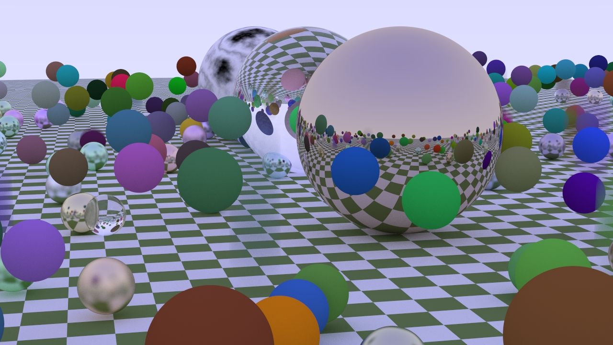
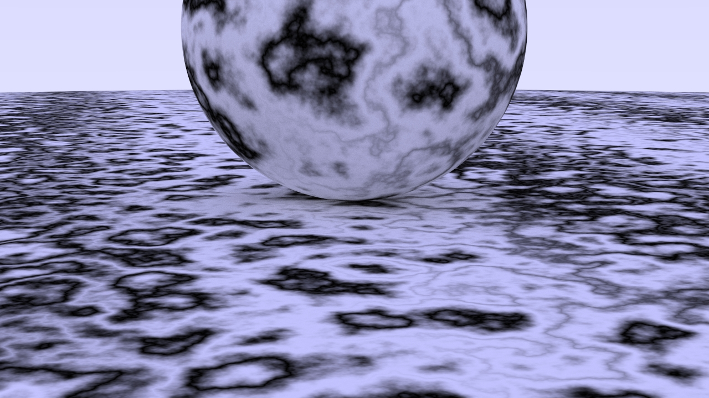
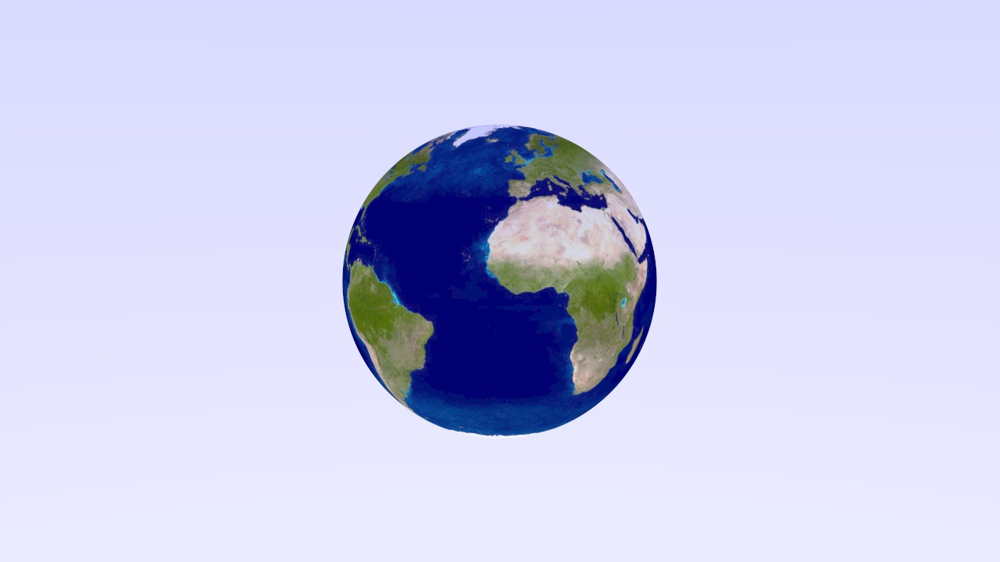
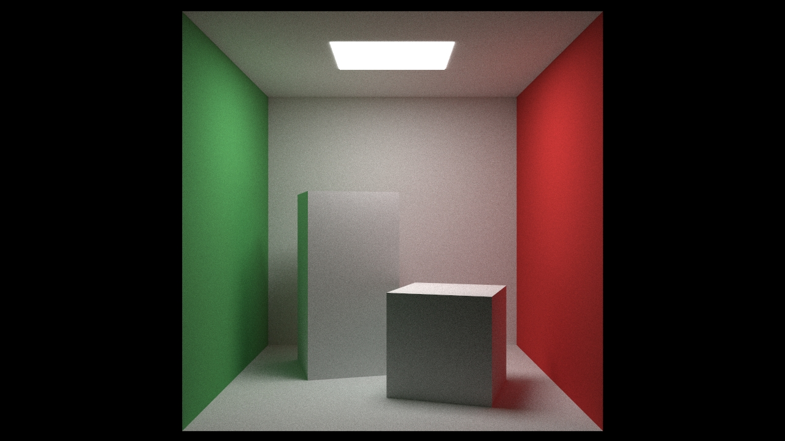
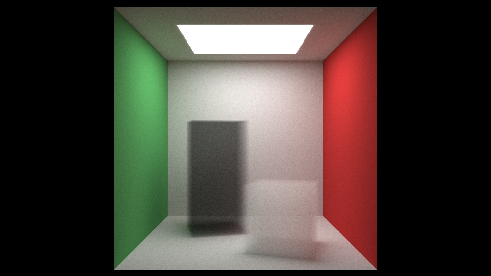
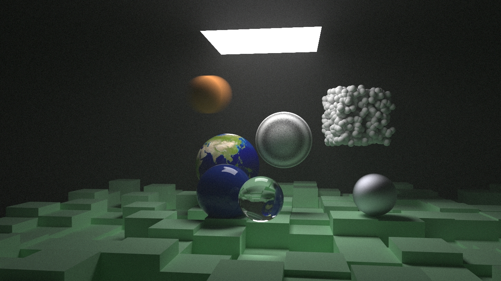

# Python Raytracing in a Weekend
A Python implementation of my [Rust raytracer](https://github.com/strohs/raytracer), inspired by the first two books 
of [Ray Tracing in One Weekend](https://raytracing.github.io/).

This is a command-line program that will render one of six sample scenes from the books.
Additionally, this implementation of the raytracer uses Python's ProcessPoolExecutor from the 
[concurrent.futures](https://docs.python.org/3/library/concurrent.futures.html?highlight=concurrent%20futures#module-concurrent.futures) 
library to help speed-up rendering. By default, it will use **half** of the detectable CPU cores on your system. This
is so that it doesn't peg all your cores at 100%. This behaviour can be overridden via the `-c` command 
line switch (see below).

The final rendered images are saved in the [ppm](http://ailab.eecs.wsu.edu/wise/P1/PPM.html) image format. 
Most modern image viewing programs should be able to display .ppm image files. 
On my linux system I used [feh](https://feh.finalrewind.org/)

Lastly, this initial version of the raytracer is not optimized. I wanted to start by using as much of the Python
library as I could, while also staying true to the object-oriented design presented in the books.
Therefore, render times are slow (as expected).  
Rendering the final scene (scene 6), at 850 pixels wide with 100 samples per pixel, on a 4 core 4.3GHz system, 
took about 2564 seconds (~42 minutes).
In the future I may investigate porting critical sections of code into numpy or different JIT compilers to see if any
performance gains can be made.

## Sample Scenes
Here are the sample scenes that can be generated using this raytracer.

These images were rendered at 1280x720 with samples per pixel set to 1000.

#### (Scene 1) Random spheres

#### (Scene 2) Perlin Spheres

#### (Scene 3) Textured Earth Sphere

#### (Scene 4) Cornell Box

#### (Scene 5) Cornell Box with smoke

#### (Scene 6) Final Scene from Book Two

## Prerequisites
Python 3.10

## Running
from the project's root directory, install the required packages:
> pip install -r requirements.txt

next, make sure you can display the command line help:
> python raytracer.py -h

finally render the cornell box scene, (scene number 4). Set the width to 480 pixels wide, and set the 
samples per pixel to 100. We'll use the default aspect ratio of 1.77 (a.k.a 16:9), `16 / 9 = 1.77`. 
The image height will be automatically determined from the width and aspect ratio.
> python raytracer.py -w 480 -s 100 4

The final image will be saved in the root directory of the project: `scene_CORNELL_BOX_480x221.ppm` as a **.ppm** image

### Command Line options
`-w` set the width of the image, defaults to 480

`-s` samples per pixels, defaults to 50. This controls the amount of multi-sampling done on each pixel. Higher values
will create images with less "spottiness", but will increase render times dramatically. 500 is a good "average" 
setting, while 5000 will create very realistic raytraced images.

`-c` core count. This is the number of cores to use for rendering. It defaults to using half of your detectable cores.

`-a` aspect ratio. The aspect ratio to use, expressed as a floating point value. 16:9 = 1.77, 
4:3 = 1.33, IMAX=14:10=1.4

### Examples
to generate the final scene (scene 6) from the second book with a width of 1280 pixels, and a 4:3 aspect ratio:
> raytracer -w 1280 -a 1.33 6                                                                                     

to generate a quick preview of the same scene, set the samples per pixel to 1
> raytracer -w 1280 -a 1.33 -s 1 6

to generate the same scene with increased image quality (set samples per pixel to 1000).
> raytracer -w 1280 -a 1.33 -s 1000 6
